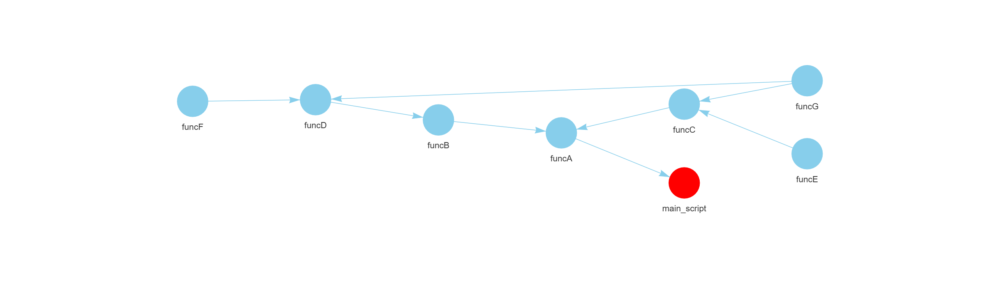

```{r, include = FALSE}
knitr::opts_chunk$set(
  collapse = TRUE,
  comment = "#>"
)
```

**funcMapper** is an R package designed to visualise all user-defined
functions in a given R script, along with any other user-defined
functions they depend on. This tool helps users understand how functions
are interconnected within a codebase.

It is especially useful for:

-   Developers new to a codebase who want to quickly understand how
    functions are used.
-   Teams working collaboratively, to track how newly added functions
    are being utilised.
-   Developers handing over a project, to provide a clear overview of
    function dependencies.

# How to Use funcMapper

**funcMapper**(script_path, output_name, output_path, source = FALSE,
cleanup_temp_file = TRUE)

Arguments:

*script_path*: File path of the R script to analyse (must end with.R).

*output_name*: Name of the output HTML file (no need to include .html).

*output_path*: Directory where the HTML file will be saved (do not
include a trailing /).

*source*: Whether to run the script to load functions into the global
environment (default is FALSE; set to TRUE if needed). If set to TRUE, the function will fail if the underlying script encounters any errors during execution.

*cleanup_temp_file*: Whether to delete the temporary script file used
during mapping (default is TRUE; set to FALSE to retain it).

The function generates an interactive HTML file containing the function
map, saved to the specified *output_path*.

# Example Output

Below is an example of the output generated by funcMapper. The map is
saved as an HTML file and can be viewed in any browser.

```{r out.width="100%", echo=FALSE}

```

In this example, the script 'main_script.R' is used as the entry point
and is highlighted in red. The map shows how user-defined functions are
interconnected. For instance, the function *funcG* is called by both
*funcC* and *funcD*.

Note: You can run funcMapper on any script, not just the main script of
a project. However, the script will be wrapped in a function during
processing. If the script is already a function, it will be wrapped
again.

# How funcMapper Works

funcMapper creates an interactive function map by analysing a specified
R script. It uses the find_dependencies() function from the
functiondepends package to recursively trace all user-defined function
dependencies.

The process involves:

1.  Wrapping the specified script in a function.
2.  Identifying and highlighting the root function in the map.
3.  Recursively parsing and mapping all nested user-defined functions.
4.  Generating an interactive VisNetwork visualisation that shows the
    structure and relationships between functions.

The main script node is highlighted in red for easy identification.
